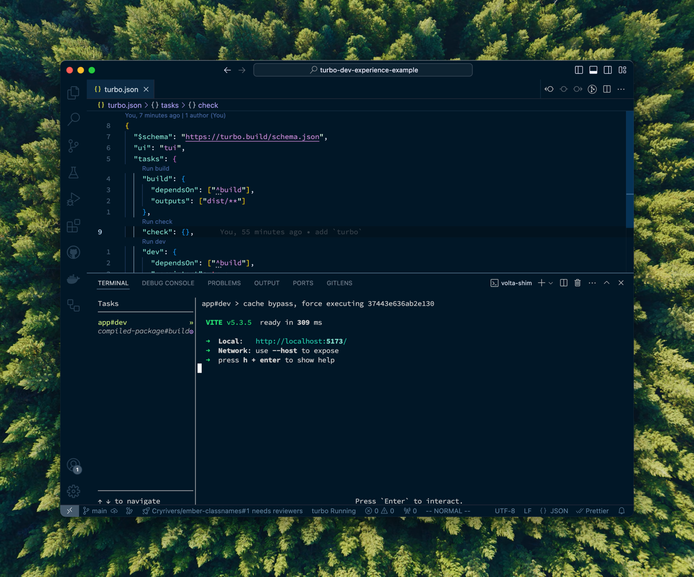

# Vite + Turborepo Mono-Repo Example

Setting up a nice development experience in a mono-repo can be really challenging, especially if you want to maintain clean boundaries between your packages. Turborepo can really help with this, though, allowing the development of your application to incorporate that of the shared packages that live alongside it.

This repo serves an example of using how to configure a clean development setup for your app, with full live-reload, _without_ your application having to handling building the shared packages. Additionally, it demonstrates all three "types" of internal packages that Turborepo defines; _compiled packages_, _just-in-time packages_ and _transit nodes_.



## Setting up the Host App

TODO

## Initial Turborepo Config

TODO

## Types of Shared Packages

Turborepo describes three "types" of internal packages that your mono-repo can have; _compiled packages_, _just-in-time_, and _transit node_ packages. The "type" dictates the relationship that the package has to the build steps of the app that consumes it.

For the purposes of this demonstration, let's establish some commonalities about all three of the package types we're going to look at:

- All of them contain source code inside a `./src` directory
- All of them intend to expose a single ESM entrypoint into the package

### Compiled Packages

A _compiled package_ is one that defines a build step that must be run in order to consume it's files. This is likely the standard way of thinking about a package, where you want the build steps to be run on their own, and your host app to consume the output of that process.

A _compiled package_ `package.json` might look something like this, where a `"build"` script is defined and the _build output_ is exported.

```diff
{
    "name": "compiled-package",
    "type": "module",
    "exports": {
+       ".": {
+           "types": "./dist/index.d.ts",
+           "default": "./dist/index.js"
+       }
    },
    "scripts": {
+       "build": "tsc --ourDir ./dist"
    }
}
```

Now, when your host app imports from this package, the `dist` files are the ones that are grabbed by Vite, and TypeScript in the host app knows how to look up type information from the generated declarations.

For the best experience while _consuming_ a _compiled package_ from your host app, there are a few TypeScript configuration options I would recommend you enable:

```json
// tsconfig.json
{
  "compilerOptions": {
    // The `declaration` property ensures that your build step generates
    // `.d.ts` files for your source code, which TypeScript will make use of
    // when type-checking your host app
    "declaration": true,

    // The `declarationMap` option generates something akin to a source map,
    // but with instructions that tell your editor how to navigate from a
    // `.d.ts` file to the original source code. With this enabled, features
    // like "go to definition" in the host app will jump right to the compiled
    // package's source code, rather than it's `.d.ts` files
    "declarationMap": true
  }
}
```

Lastly, we need to tell Turborepo about the relationship between the host app's development server and the _compiled package_'s build step. We can update the root-level `turbo.json` file to look like so:

```diff
{
  "$schema": "https://turbo.build/schema.json",
  "ui": "tui",
  "tasks": {
+   "build": {
+     "outputs": ["dist/**"]
+   },
    "dev": {
+     "dependsOn": ["^build"],
      "persistent": true,
      "cache": false
    }
  }
}
```

Now, when we run the `dev` command, Turborepo will make sure to run the dev server of your Vite app and, in parallel, will run the build script of your _compiled package_. Turborepo will take care of watching the source files of your _compiled package_ and re-running the build script to generate new output files. In the host app, Vite is smart enough to see the change in the compiled output and automatically reload your dev server, pulling in the newly-built files. In this way, you maintain your live-reload experience without needing the host app to take responsibility for building it's dependency.
